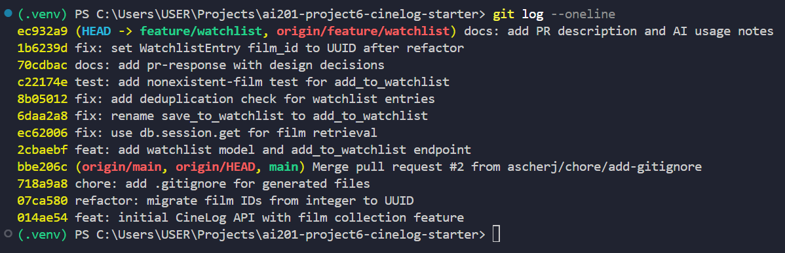

# PR Response Doc — CineLog Watchlist Feature

## AI Usage

I used AI (Claude) at several specific points in this project:

- **Codebase orientation:** I asked it to explain how `add_to_collection` persists data (the `db.session.add` vs `db.session.commit` distinction) and what the `CollectionEntry` model actually enforces, so I understood the existing pattern before mirroring it for the watchlist.
- **Verifying the rename (Comment 1):** I had it confirm I'd updated every `save_to_watchlist` call site and check that a project-wide search for the old name returned zero matches.
- **Verifying commit format (Milestone 4):** I gave it my `git log --oneline` output and asked whether the messages followed Conventional Commits and whether any commit bundled multiple logical changes. It flagged that my `test:` commit was mislabeled `feat:`, my docs commit was mislabeled `refactor:`, and that `added watchlist model and endpoint fixed a bug more changes` bundled several changes — I then reworded them via `git rebase -i`.
- **Debugging the rebase (Comment 6):** When `pytest` failed with `ImportError: cannot import name 'WatchlistEntry'`, it helped me trace that the rebase had silently dropped the model class from `models.py`, and I restored it with a UUID `film_id`.
- **Stress-testing my design arguments (Comments 4 & 5):** I drafted my own positions first, then asked AI to poke holes in them. For **Comment 4 (visibility)**, my original draft only argued "public fosters community"; the AI pushed me to name the *specific* user behavior (empty new accounts + defaults are rarely changed) and to acknowledge the concrete privacy tradeoff, which my final version now does. For **Comment 5 (sort order)**, my first draft contradicted itself by saying I "completely agree" with the reviewer while arguing against him; the AI caught that, and my final argument reframes it as a "transient vs. durable need" tradeoff instead of a flat preference. The positions are mine — AI was used to sharpen the reasoning, not generate the stance.


## Comment 1 — Rename
**What I did: Renamed save_to_watchlist → add_to_watchlist and updated every call site.**
**Call sites checked/updated:**
**services/watchlist_service.py — the function definition**
**routes/watchlist/watchlist.py — the import and the call inside the POST /watchlist/<user_id>/add handler** 
**How I verified: Used Find All References (Shift+F12) on the function and Ctrl+Shift+F (Find in Files) to search the whole project for the old name save_to_watchlist — 0 matches remain, confirming no call site was missed. Confirmed the new name resolves correctly by running pytest tests/test_watchlist.py -v, which imports and calls add_to_watchlist — 1 passed.**

## Comment 2 — Deduplication
**What I did: Imported AlreadyInCollectionError from services.collection_service to prevent a film being added to a collection twice. A variable existing queries the CollectionEntry table with .filter_by(user_id, film_id).first(), returning the matching collection entry or None. If existing holds an entry (i.e. the user has already logged this film), AlreadyInCollectionError is raised.**
**How I verified: by running pytest tests/test_collection.py::test_add_to_collection_duplicate_raises -v**

## Comment 3 — Missing test
**What I did: I added tests/test_watchlist.py with test_add_to_watchlist_nonexistent_film_raises, mirroring the collection test's fixtures and assertions.**
**How I verified: pytest tests/test_watchlist.py → 1 passed.**

## Comment 4 — Default visibility
**My position: Watchlists should default to public=True. This is an intentional choice for CineLog specifically, not an inherited framework default.**

**Reasoning: CineLog is a community film-tracking app, so I'm optimizing for discovery and social engagement. A new user's account starts empty.The fastest way to give them value is letting them browse what others are planning to watch and pull ideas into their own list. Public-by-default makes that the norm rather than the exception: if visibility defaulted to private, the shared library that makes the app worth joining would stay mostly empty even as users added films, because most people never change a default. Defaulting to public keeps the community feed populated and makes the social loop (browse → discover → add) work out of the box.**

**Tradeoff acknowledged: The cost is user privacy. Defaulting to public means a user could expose their viewing intentions before realizing their list is visible. Someone may treat a watchlist as private by assumption. A private-by-default option would protect that user but at the expense of a near-empty community view. I think public-by-default is the right call for this product, and the risk is bounded because public is a per-entry field (models.py:80) . Users can mark individual films private rather than being locked in. If we later add sensitive-content handling or an account-level "private profile" mode, this default is worth revisiting.**

## Comment 5 — Sort order
**My position: Keep the watchlist default sorted alphabetically by title. (No code change — get_watchlist already orders by Film.title.asc().)**

**Reasoning: A watchlist is a reference list you return to, not a feed you scroll once. Its whole purpose is "I've got two hours free — what did I mean to watch?" That's a lookup task, and alphabetical order gives every film a stable, predictable position: if a title starts with "Ab," the user knows roughly where it sits without scanning the whole list or opening search. This advantage compounds as the list grows — at 50+ films, date-added order becomes an undifferentiated pile where the only way to find a specific title is to remember when you added it.**

**Engagement with reviewer's point: You're right that recency matters — for the newest couple of entries, and right after adding something. But I'd push back on it being the default for two reasons. First, that recency need is transient (it fades once the film has sat on the list a day), while the findability need is permanent and grows with the list. Second, "what did I add recently" is a narrower question than "where is the film I'm looking for," which alphabetical answers better for a longer watchlist. So I think we're weighing a strong-but-short-lived benefit against a modest-but-durable one, and I'd favor the durable one for the default.**

**If you'd still prefer recency (a fair call), the cleanest resolution is to keep alphabetical as the default display order but add a sort toggle (?sort=date_added) so users get recency on demand — that honors your use case without making it the default. Happy to implement that instead if you'd rather.**

## Comment 6 — Rebase
**What conflicted: .gitignore (a trivial add/add overlap). The UUID change did not surface as a Git conflict — instead, main's rewrite of models.py silently dropped my WatchlistEntry class during the rebase.**
**How I resolved it: Resolved .gitignore by keeping all entries. Then caught the silent loss when pytest failed with ImportError: cannot import name 'WatchlistEntry'. Re-added the WatchlistEntry model with film_id as db.String(36) (UUID) to match main's refactor, and updated the watchlist docstrings from int to UUID.**
**How I verified: git log --oneline --graph shows a linear history with no merge commits; pytest -v → 5 passed.**
## PR Description

### What this feature does
This PR adds a **watchlist** to CineLog — a list of films a user wants to watch later, separate from their collection (films they've already watched). It introduces:

- A `WatchlistEntry` model (`user_id`, `film_id`, `date_added`, `public`), with `film_id` as a UUID to match main's post-refactor `Film.id`.
- `add_to_watchlist(user_id, film_id)` in `services/watchlist_service.py`, which validates the film exists (raises `FilmNotFoundError` otherwise) and guards against adding a film already in the user's collection (raises `AlreadyInCollectionError`).
- `get_watchlist(user_id)`, returning the user's watchlist as a list of film dicts.
- Two endpoints: `POST /watchlist/<user_id>/add` (body `{ "film_id": "<uuid>" }`) and `GET /watchlist/<user_id>`.
- A test (`tests/test_watchlist.py`) covering the nonexistent-film case.

### Design decisions
1. **Default visibility → `public=True`.** Watchlists are public by default because CineLog is a community app optimizing for discovery: new accounts start empty, and since most users never change defaults, a public default keeps the shared browse-and-discover feed populated. The tradeoff is privacy — a user could expose viewing intentions before realizing lists are visible — which is bounded by `public` being a **per-entry** field, so individual films can be made private. (Full reasoning in Comment 4.)
2. **Default sort order → alphabetical by title.** A watchlist is a reference list you return to, so I optimized for *findability* (a stable, predictable position per title) over recency. I engaged the maintainer's "recent-first" preference directly: recency is a strong but *transient* need, while findability is *durable* and grows with the list. Offered a `?sort=date_added` toggle as a compromise if recency is preferred as the default. (Full reasoning in Comment 5.)

### How to manually test the feature
These steps use PowerShell (`Invoke-RestMethod`), which handles JSON quoting cleanly on Windows.

1. **Seed a user and a film:**
   ```
   python seed_demo.py
   ```
   Copy the printed `USER_ID` and `FILM_ID` (both are UUIDs).

2. **Start the app** (in a separate terminal):
   ```
   python app.py
   ```

3. **Add a film to the watchlist** — expect `201` and the new entry:
   ```powershell
   $userId = "<USER_ID>"
   $body   = @{ film_id = "<FILM_ID>" } | ConvertTo-Json
   Invoke-RestMethod -Uri "http://localhost:5000/watchlist/$userId/add" `
     -Method Post -ContentType "application/json" -Body $body
   ```

4. **View the watchlist** — expect the film you just added:
   ```powershell
   Invoke-RestMethod -Uri "http://localhost:5000/watchlist/$userId"
   ```

5. **Test the not-found guard** — adding a nonexistent film should return `404`:
   ```powershell
   $bad = @{ film_id = "00000000-0000-0000-0000-000000000000" } | ConvertTo-Json
   try {
       Invoke-RestMethod -Uri "http://localhost:5000/watchlist/$userId/add" `
         -Method Post -ContentType "application/json" -Body $bad
   } catch { $_.Exception.Response.StatusCode.value__ }   # -> 404
   ```

6. **Run the test suite** — expect all green:
   ```
   pytest -v
   ```

### Screenshot of clean commit history
<!-- Paste your `git log --oneline` screenshot here after the interactive rebase -->

### Commit history (no merge commits, conventional format)
```
ec932a9 docs: add PR description and AI usage notes
1b6239d fix: set WatchlistEntry film_id to UUID after refactor
70cdbac docs: add pr-response with design decisions
c22174e test: add nonexistent-film test for add_to_watchlist
8b05012 fix: add deduplication check for watchlist entries
6daa2a8 fix: rename save_to_watchlist to add_to_watchlist
ec62006 fix: use db.session.get for film retrieval
2cbaebf feat: add watchlist model and add_to_watchlist endpoint
```
(All 8 commits use conventional format; no merge commits on the branch — `bbe206c` is main's own merge, which is the rebase base.)


